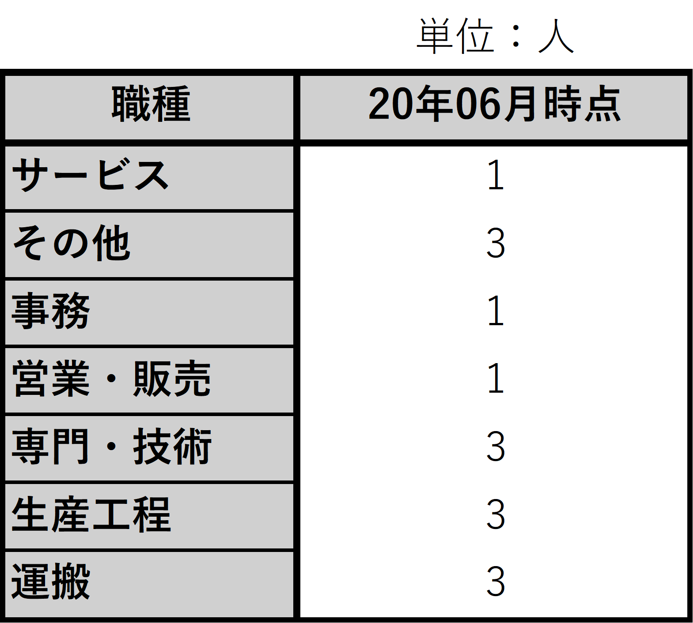
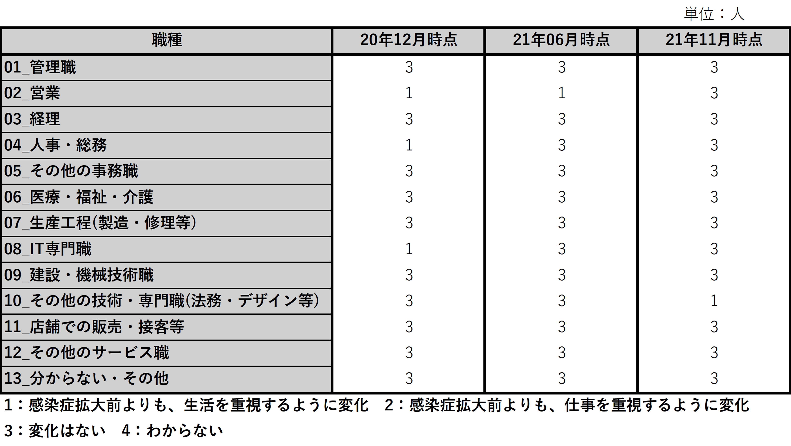
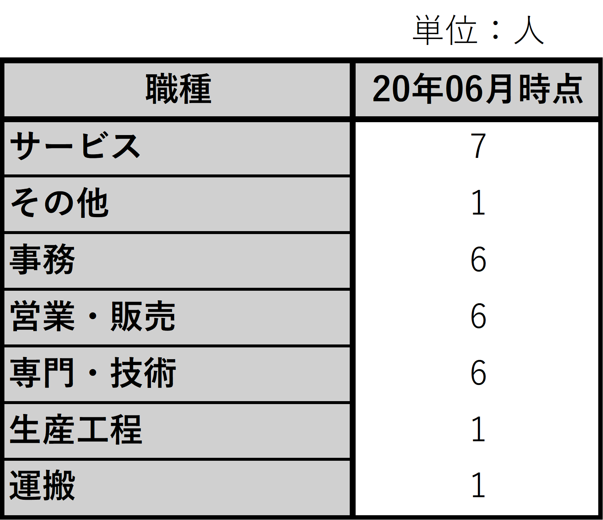
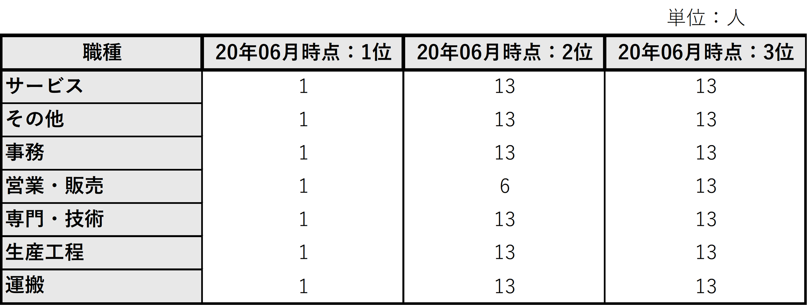
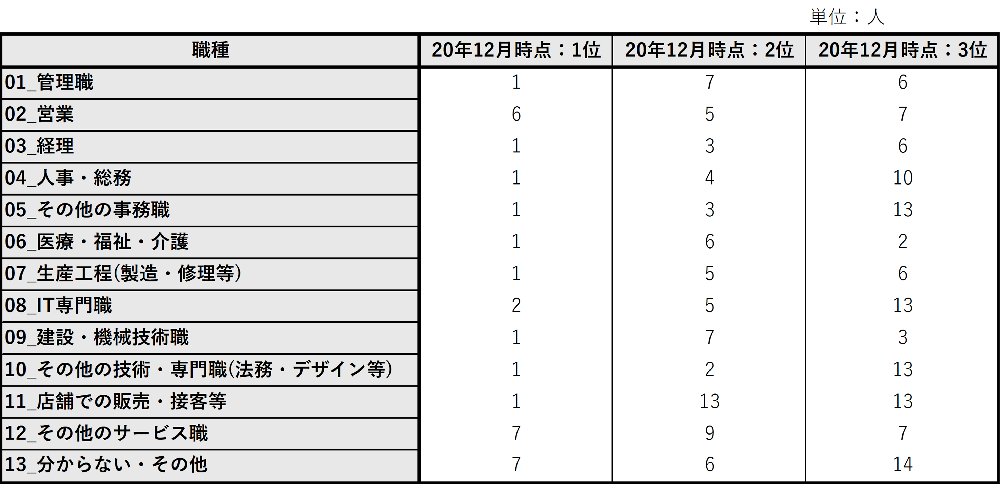
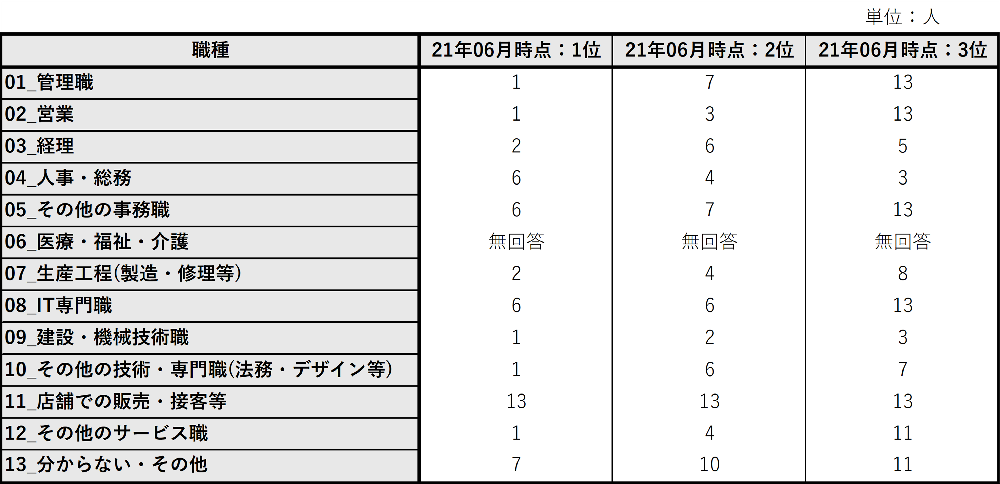
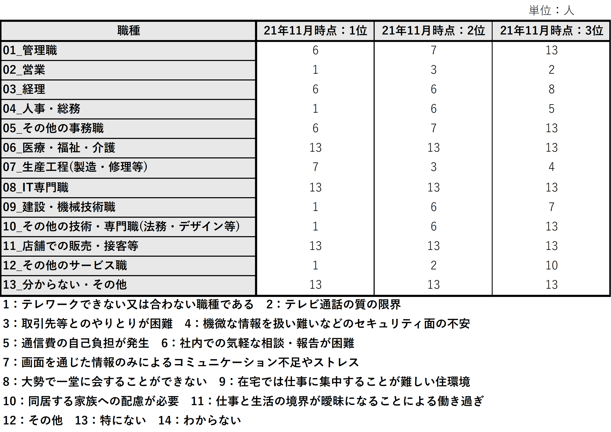

# 新型コロナウイルス感染症における日常生活の時空間変化　ー首都圏の三県を事例にー

## 目次

- [新型コロナウイルス感染症における日常生活の時空間変化　ー首都圏の三県を事例にー](#新型コロナウイルス感染症における日常生活の時空間変化ー首都圏の三県を事例にー)
  - [目次](#目次)
  - [はじめに](#はじめに)
    - [研究の背景](#研究の背景)
    - [研究の目的と手法](#研究の目的と手法)
  - [調査データの概要](#調査データの概要)
    - [新型コロナウイルス感染症の影響下における生活行動調査](#新型コロナウイルス感染症の影響下における生活行動調査)
    - [新型コロナウイルス感染症の影響下における生活意識・行動の変化に関する調査](#新型コロナウイルス感染症の影響下における生活意識行動の変化に関する調査)
  - [コロナによる社会状況の変化](#コロナによる社会状況の変化)
    - [代表的な感染症対策](#代表的な感染症対策)
    - [コロナ禍における感染症対策や主な出来事](#コロナ禍における感染症対策や主な出来事)
    - [人流データを用いたコロナにおける全体的な傾向の把握](#人流データを用いたコロナにおける全体的な傾向の把握)
  - [国交省調査の分析結果](#国交省調査の分析結果)
    - [事務従事者](#事務従事者)
    - [管理的職業従事者](#管理的職業従事者)
    - [専門的・技術的職業従事者](#専門的技術的職業従事者)
    - [サービス職業従事者](#サービス職業従事者)
    - [主婦](#主婦)
    - [定年退職者](#定年退職者)
    - [分析結果のまとめ](#分析結果のまとめ)
  - [内閣府調査の分析結果](#内閣府調査の分析結果)
    - [生活の満足度](#生活の満足度)
    - [家庭に関する意識](#家庭に関する意識)
    - [仕事に関する意識](#仕事に関する意識)
  - [分析結果の考察](#分析結果の考察)
    - [権威の制約としての感染症対策](#権威の制約としての感染症対策)
    - [職住分離の空間構造の変化](#職住分離の空間構造の変化)
  - [おわりに](#おわりに)
  - [参考文献リスト](#参考文献リスト)

## はじめに

### 研究の背景

2020年から現在に至るまで新型コロナウイルス感染症（以下，コロナとする）は流行している。初期の頃は，感染力が高い上，重症化になりやすく，最悪死に至る危険性があった。そのため，世界各国が自国民への感染を抑制するため，外出禁止や入国規制などを行った。日本も例外ではなく，「緊急事態宣言」や「まん延防止等重点措置」など，国民に対し協力という形で感染対策に臨んだ。しかし，感染症は拡大し，人々は新しい生活様式に努めなければならなかった。その過程の中で，不要不急の外出の自粛や3密（密集，密接，密閉）の回避，テレワーク・在宅勤務の推奨など，従来の生活様式には無かったことを実践した。このように，社会経済的な活動への影響は明白であり，それらを研究することは重要である。また，現在進行形のポストコロナ社会を捉える上でも必要となる。

日本におけるこれまでのコロナに関する研究の多くは，主に医療・看護・公衆衛生分野の研究である。しかしながら，日常生活に与えた影響についての研究も存在する。例えば，小田中・牛膓（2023）は，コロナ禍中で経験したことや対人関係の変化についてインタビュー調査を行い，その結果と既存の社会理論との関連性を明らかにしている。また，大森・熊越（2022）は，東京都市圏の公示地価の増減と付与されている不動産鑑定士のコメントを分析し，コロナ禍における土地のニーズについて明らかにした。
他方，学術研究だけでなく，政府機関の調査も行われた。例えば，内閣府のワーキングペーパーでは，令和3年度社会生活基本調査を用いて，在宅勤務・テレワークが生活に与えた影響について分析し，男女間での差や子供の有無で生活時間に違いがあることを明らかにしている（山地ほか，2024）。また，宿泊旅行統計調査のデータを基に，2020年における日本人及び外国人観光客の宿泊需要についての分析も行われた（栗原ほか，2022）。

コロナが日常生活に与えた影響の研究は，上記のように成されているが，その多くは社会学的視点によるものだ。他方，コロナに関する地理学的な視点の研究も存在している。Kato（2022）は携帯電話位置情報を用いて，郊外都市における感染者数と行動範囲の相関関係を分析し，感染者数の減少と行動範囲の縮小の相関関係は低いことを明らかにした。また，Kotsubo（2024）は住民基本台帳を基にコロナ禍における移住パターンを分析し，コロナ禍では都心から郊外への移住が増加することを明らかにした。このように，人流解析などを行う地理学的な研究はいくつか見られる。移動に関する研究が多い理由として，地理空間の変化が起きていないことが挙げられる。コロナは通常の自然災害とは異なる特性を持つ。人的な被害という点でこそ共通するものの，ビルや施設などの建造物に対する物理的な破壊や地形変化を起こしていない。それ故，人の移動や行動を軸に分析する必要がある。

移動の変化はGPSログ等の地理データを用いて分析することが出来る。移動の変化を捉えることは，コロナというダイナミックな変化を理解することが可能である。しかし，そのようなデータは個人情報の観点で詳細な個人属性が秘匿化されていることが多く，どんな人々の移動に影響を与えたのかが不鮮明になる。同様に，そこで行われている活動も表現することは難しい。それ故，コロナが与えた生活行動への影響に関する地理学的な研究は少ない。

そこで，本研究はコロナによって変化した社会的属性の異なる人々の生活行動を比較する。そのような視点の研究では，時間地理学の手法が有用であり，時間地理学は特定の社会状況下における生活行動を時空間の配置によって記述することが出来る。

### 研究の目的と手法

本研究の目的は，生活行動調査のデータを使用しコロナ禍における社会属性ごとの時空間の変容について分析を行うことである。

本研究では，国土交通省の生活時間調査を用いて流行前とコロナ禍である2020年4月から2022年12月までの空間，時間，活動の関係を定量的に分析する。また，アンケート調査を用いて生活意識の変化についての分析も行う。使用するデータは，「新型コロナ感染症の影響下における生活行動調査(以下，国交省調査)」と「新型コロナウイルス感染症の影響下における生活意識・行動の変化に関する調査(以下，内閣府調査)」の2つである。

対象地域は埼玉県，千葉県，神奈川県の3県である。対象者は，事務従事者，管理的職業従事者，専門的・技術的職業従事者，サービス職業従事者，主婦，定年退職者の6属性を対象とする。選定する過程等は第2章で述べる。

定量的な分析は国交省調査を使用する。各社会属性における時系列ごとの平均滞在，活動時間を表で示す。また，時間地理学の特徴である時空間経路図は事務従事者，管理的職業従事者，専門的・技術的職業従事者の3属性を対象に図示する。作成方法は，まず滞在場所の最頻値を時間帯ごとに算出し，典型的な1日のモデルを表す。このモデルを調査日ごとに作成し，1つの時空間経路図にする。これにより，1つの図で時系列的に時空間の変容を把握することが出来る。

時空間経路図の対象を絞った理由として，対象の3属性は行動パターンが一定であったからだ。その他の社会属性は夜間勤務のような個々で活動を行うタイミングが異なっていたり，家にいる時間が大半を占めていたりする。そのため，本研究の手法によるモデル化は適していなかったため除外した。

生活意識の分析は内閣府調査を使用し，第2章でも述べるように時間地理学的な分析を補うために用いた。本研究では，各調査回に共通で聞かれている生活の満足度，仕事に関する事項，家事・育児に関する事項を主に分析する。その後は，分析結果からコロナ禍で変容した生活について考察を行う。

## 調査データの概要

この章では，調査データの概要を説明し，本研究における対象地域と対象者の選定経過を示す。国交省調査は本研究の主軸となるものであり，この調査を基に対象となる地域や社会属性決め，時空間の配置や活動について分析する。内閣府調査は対象となる地域や社会属性は前者を基にし，時空間の配置だけでは捉えることのできない部分を補うために用いた。

### 新型コロナウイルス感染症の影響下における生活行動調査

　国交省調査は，国土交通省(以下，国交省)がポストコロナ以降のまちづくりに向けてコロナ禍で変容した生活を把握する目的で行った調査である。調査形式は，Web上でのアンケート調査と15分単位の生活時間調査を行っている。実施された回数は，令和2年度8月，令和3年度3月，令和4年度12月の計3回である。表1では，調査日，回答者数，調査地域について表した。

表1

この調査は，令和2年度から4年度にかけて毎年度実施され，調査日は流行前から2022年12月までの7つの時点で行われた。それ故，コロナ禍での時系列的な分析に非常に有用である。ただし全ての調査日は平日であったため，休日中の行動については考慮できていない。調査日と社会状況の関連性については第3章で詳しく述べる。

回答者数については概ね11,000人から12,000人の間を推移している。この調査では前回調査のIDを回答する項目があり，総回答者数は減るが，全ての調査に回答した人(以下，全回答者)を抽出することが可能となる。そのため，本研究では全回答者のデータを使用する。具体的な対象者の選定については後述する。また，生活時間調査とアンケート調査は別々の回答者であることに留意したい。図示している回答者数は生活時間調査の回答者数である。図1は，国交省調査の調査地域を示している。

図1

調査地域の選定に関して，国交省（2020）は「新型コロナウイルスの感染者が多い東京都市圏及び，全国的な傾向を把握するため，全国都市交通特性調査の対象地域から都市類型や特定警戒都道府県の有無の観点から対象都市を抽出」している。東京都市圏では茨城県南部以外の地域が県単位で行われている。その他の対象地域は市単位での調査である。

国交省（2020）によると，令和2年度時点では緊急事態宣言解除後(2020年7月31日)でも自宅で長く過ごす傾向があることや，オンラインやリモート活動の意向は商品購入等が高く，飲み会などのコミュニケーションに関するものは低いといった速報結果がある。これらの結果は全体傾向であるため，社会属性ごとの差異などが不鮮明である。また，活動時間が増えたことを把握できても，それがどのタイミングで変化しているのかまで分析されていない。そのような変化は時空間経路図を用いることで表すことが出来る。

国交省調査を用いた研究は少ないものの，岡田（2021）では，テレワークの導入が社会属性によって異なることや，地域内の感染者数の高さと正の相関があることを明らかにしている。また，石橋（2023）は，PT調査と組み合わせ，働き方や自動車保有状況によってコロナ禍での身体的活動量が異なることを明らかにしている。これらの研究は令和2年度調査を使用していることが多く，それ以降の調査を用いた研究や，各調査年度を組み合わせて時系列的に分析を行っている研究は少ない。

次に国交省調査に類似するデータとして，総務省統計局が出す社会生活基本調査が挙げられる。調査形式は，国交省調査と同様にアンケート調査と15分単位の生活時間調査である。この調査は都道府県単位で行われており，調査頻度は5年毎である。最新の調査は2021年であり，この調査のみでコロナによる時系列的な影響を捉えるのは難しい。故に，時系列的な影響を捉えるには国交省調査を使用するのが望ましいだろう。

最後に対象地域と対象者の選定を行う。前述したように全回答者のデータを使用する。全回答者の人数は1,550人（男性：955人/女性：595人，1年度あたり）である。全回答者にすることで，データの整合性が向上し，個々の変化をより正確に捉えることができる。対象地域は回答者数を確保しつつ，複数地域を比較したいため，回答者数のバラつきが少ない地域を選定する。コロナ禍で変化を受けた職業従事者や非有職者などを考慮に入れながら，回答者数が多いものを選定する。図2は3年度分の回答者を集計し，その合計人数に基づいて地域別に表したものである。

図2　3年度分の合計人数に基づいた地域分布　（単位：人）　（国交省調査を基に作成）

埼玉県，千葉県，神奈川県の3県は550人前後と回答者数も多く，また，ばらつきも少なく分布しているため，本研究ではこの3県を対象地域とする。また，これらの地域は1都3県の連携を掲げ，足並みを揃えながら感染症対策に取り組んでいた。そのため，各地域における生活の変容が一様であれば感染症対策によるものとして把握でき，異なれば地域固有のものとして把握できる。東京都を除いた理由としては，回答者数が極めて多い上，3県と比べ経済規模や人口規模が明らかに異なるからだ。表2は対象地域の回答者数を表したものである。

表2

図3は令和2年度調査時点における対象地域内での社会属性の数とその男女構成である。その他の調査年度も同様の傾向を示しているため，令和2年度調査のみで選定をした。各職業の定義は総務省の定める日本標準職業分類に基づいている。最も多い回答者は無職であり，次いで主婦・主夫(以下，主婦)と非有職者が多いことが分かる。

しかし，職業従事者に関しても時空間の変容が起きている可能性があるため，分析を行うべきである。したがって，次点で回答者の多い事務従事者や管理的職業従事者，専門的・技術的職業従事者も対象者として含める。加えて，対面接触を必要とする職業従事者としてサービス職業従事者も含める。

また，主婦に関しては，男女数を考慮して女性のみを対象とする。そして，無職に関しては，図4に示しているように60歳以上の男性が最も多い。このような特徴に該当する社会属性として挙げられるのは，定年退職者である。そのため，本研究においては無職から60歳以上の男性のみを抽出し，定年退職者として扱い分析を行う。

図4

したがって，本研究での対象地域は埼玉県，千葉県，神奈川県の3県であり，対象者は事務従事者，管理的職業従事者，専門的・技術的職業従事者，サービス職業従事者，主婦，定年退職者の計6つの社会属性の人々とする。

### 新型コロナウイルス感染症の影響下における生活意識・行動の変化に関する調査

内閣府調査は，内閣府がコロナ禍において人々の生活意識や行動がどのように変化したのかを把握する目的で行った調査である。調査形式はWeb上でのアンケート調査である。表3は本研究で使用する調査日，回答者数，調査地域を表したものである。実施された回数は，2020年6月21日，2020年12月24日，2021年6月4日，2021年11月1日，2022年7月22日，2023年4月19日の計6回である。本研究では，2020年6月21日から2021年11月1日の計4回の調査を使用する。

回答者数は約10,000人が回答している。国交省調査と同様にIDの追跡が可能であり，全回答者を抽出することが出来る。本研究では，内閣府調査も全回答者のデータを使用する。調査地域は都道府県単位で行われている。対象地域や対象者は国交省調査を基準とする。留意点として，内閣府調査は業種別で職業が分類されているが，職業分類自体は総務省の定める日本標準職業分類に基づいているため整合性を取ることは可能である。調査日については，第3章で社会状況と関連させながら述べる。

この調査を使用する目的としては，時間地理学的に分析をする国交省調査を補強するためである。時間地理学の弱点として，人の内面についての理解が出来ない点がある。時空間経路図を利用して時空間的な不利益や不平等を把握できるものの，そのような状況下で人々がどのような思いを持っているのかを把握できない。それ故，時間地理学の研究ではアンケート調査と組み合わせることが多い。本研究でも同様に，内閣府調査を用いて内面的な部分を補うこととする。

前述したように国交省調査でもアンケート調査が行われているが，回答者が異なる。さらに，質問内容は活動頻度や外出する場所などの生活時間調査を設問形式に直したようなものが多い。内閣府調査も国交省調査における生活時間調査の回答者と異なっている。しかし，国交省調査のアンケート調査に比べ，生活の満足度や，テレワークに関する意識，家事・育児の役割変化，移住への関心などの生活意識に関わる質問内容が多い。そのため，内閣府調査は国交省調査のアンケート調査よりも内的な側面を補うものとして有用である。

## コロナによる社会状況の変化

この章では，初めに代表的な感染症対策の特徴を述べ，その後2020年から2022年までのコロナによって変化した社会状況について整理する。

### 代表的な感染症対策

代表的な感染症対策として挙げられるものは，緊急事態宣言，まん延防止等重点措置，BA5対策強化宣言の3つである。図5では，各対策の特徴について内閣感染症対策危機管理統括庁や自治体の資料等を基に整理して示した。

図5

緊急事態宣言は，都道府県単位で時短・休業要請を指示することが出来る。他の対策と異なる点として，休業要請やイベントの停止が取れる点と外出自体に自粛要請を取れる点がある。前者は営業自体を止められるため，サービス職業従事者のような職業は時空間的に大きな制約を受ける可能性がある。後者は「自粛」という諸外国に比べ強制力が低いものではあるが，廣井（2020）の研究では，様々な社会属性の人々，特に主婦や高齢者は外出を控えるようにしていた。そのため，外出自粛の影響は大きいといえる。

まん延防止等重点措置は，緊急事態宣言より制限が弱い。緊急事態宣言による制限は社会経済的活動に大きな支障をもたらすため，ある程度活動を維持しながら感染症対策を行っていくことが狙いにある。期間は6ヶ月以内と短いものの，延長期間の際限が無いことで時間の調整がしやすい。それ故，まん延防止等重点措置は柔軟な対応を取れるという利点がある。

BA5対策強化宣言は，他2つの対策とは目的が異なり，オミクロン株の流行を抑えるための限定的な対策である。対象地域は都道府県単位と広範でありながらも，その強制力は極めて低い。これは，感染力は強いが，重症化しにくい特徴をもつBA5というオミクロン株の一種が当時流行していたことと関係がある。感染リスクの高い行動を控えるよう促すのみにし，時短・休業要請のような社会経済的活動に支障が出る制限は行わない方針で作られた感染症対策である。しかしながら，免疫力があまりない高齢者や基礎疾患を持つ人々は重症化しやすいので外出自粛の要請を行う形が取られている。

図6では，上記3つの感染症対策における適用地域の分布を表したものである。第1回緊急事態宣言の凡例における最初期とは2020年4月7日時点である。最後期は2020年4月16日の適用地域を拡大した時点のものである。まん延防止等重点措置における適用とは，端を発した2021年4月頃から各種対策が一斉に解除される同年の9月末までにまん延防止等重点措置を実施した地域である。BA5対策強化宣言における適用地域とは，端を発した2022年7月末から同年8月までにBA5対策強化宣言を実施した地域のことである。

図6

第1回緊急事態宣言は最終的に47都道府県の全てに適用されている。まん延防止等重点措置において，東北地方や中部地方の一部では実施されていないことが分かる。BA5対策強化宣言では，まん延防止等重点措置より実施された地域は減っているものの，離散的に実施されていることが分かる。

### コロナ禍における感染症対策や主な出来事

次に，コロナ禍の時系列的な流れを概観する。表4では，2020年から2022年までにコロナに関する出来事や実施された感染症対策，そして調査データの実施日を示したものである。

表4

コロナの始まりは2019年末に中国の武漢で発見された原因不明の感染症であった。日本で周知されるようになった大きなきっかけは，2020年2月頃に起きたクルーズ船「ダイヤモンド・プリンセス号」による感染拡大だろう。それ以降，徐々に感染症は拡大していき，同年4月から日本で初となる緊急事態宣言が発出された。しかし，感染症の勢いが収束することはなく，感染拡大と対策が何度も取り組まれた。

2021年からはアルファ株を端とする従来よりも感染力の強い変異株が登場し，より一層感染が拡大していった。また，同年7月には，延期していた東京オリンピックを開催するなど，ある程度の社会経済的活動を行うようにもなった。最終的に2023年4月頃にコロナは5類に移行することになった。

国交省調査の調査日を見ると，2回目から4回目までの緊急事態宣言が発出された期間の調査が行われていない。したがって，緊急事態宣言による時空間的な変容については，コロナ流行前，2020年4月16日~5月13日と2020年7月31日の3時点を対象とする。まん延防止等重点措置については，2022年3月1日の調査日が発出中に行われた唯一の時点であるため，この時点を対象とする。そして，BA5対策強化宣言は2022年9月末に解除されているため，解除後の2022年12月頃の2つの調査日を対象とし，解除後の影響を分析する。特異な時点として，2021年12月1日がある。この調査日は，2021年9月から10月にかけて緊急事態宣言を含む様々な感染症対策や要請が解除されている時期の直後であるため，コロナ禍でありながら制限を一切受けていない時点として見ることができる。

内閣府調査の方では，2020年6月21日が緊急事態宣言解除の直後の時点である。2020年12月24日は緊急事態宣言解除後から半年が経った時点である。2021年6月4日はまん延防止等重点措置下の時点である。2021年11月1日は2021年10月末の各種制限・要請の全面解除の直後の時点である。BA5対策強化宣言下の調査日はないことに留意したい。

### 人流データを用いたコロナにおける全体的な傾向の把握

最後に，首都圏におけるコロナの影響について全体的な傾向を捉えるため，人流データを基に分析を行う。データは国土交通省が作成した「全国の人流データ（1kmメッシュ，市区町村単位発地別）」を使用する。このデータは，1kmメッシュに1ヶ月間における1日当たりの平均人口を記録している。集計期間は2019年から2021年までの36ヵ月間である。本研究では，国交省調査の調査日を基に，流行前の時点，2020年4月時点，2020年7月時点，2021年12月時点の滞在人口の変化を分析する。流行前の時点については，第1回緊急事態宣言の1年前である2019年4月時点のデータを用いる。

図7は，5段階に自然分類した2019年4月時点の滞在人口を指標とした各時点における首都圏の滞在人口を地図化したものである。流行前の滞在人口を指標とすることで，流行前に対する各時点での滞在人口を比較することが可能となり，流行前からどの程度の変化が起きたのかを把握することができる。

図7

2019年4月時点では，東京都心を中心に滞在人口が約4万人以上のメッシュが多く存在している。2020年4月時点になると，4万人以上のメッシュは大きく減り，10万人以上のメッシュに関してもなくなった。第1回緊急事態宣言が解除された2020年7月時点になると，同年の4月時点よりも4万人以上のメッシュが若干増加していることが分かる。そして，各種制限が全て解除された2021年12月時点では，10万人以上のメッシュが1つ現れた。

以上のことから，強制力の高い感染症対策が行われている際は人の移動が減り，強制力が弱くなるにつれて人の移動が回復していることがわかる。しかし，先行研究と同様に，どのような人々の移動に影響を与えたのかが明確になっている。

## 国交省調査の分析結果

この章では，国交省調査を基に行動フラグの選定について述べ，その後各社会属性の分析結果を述べる。図8は行動フラグの選定過程を示している。選定を行った理由として，各行動フラグの平均時間を算出し比較する際に，行動フラグ間のバラつきが多かったからである。したがって，行動フラグの内容を基に可能なものは統合した。

図8

元々の行動フラグは31種類であり，選定後は17種類となった。活動自体を行っていなかったり，特定の個人のみ行っていたりするものは削除した。統合したものは，全て家事・育児に関連するものである。統合前では行動フラグ14や16などと比較する際に，細分化されているため比較が難しくなる。そのため，今回は行動フラグ17「家事・育児」として一つに統合した。

### 事務従事者

事務従事者は，「一般に課長（課長相当職を含む）以上の職務にあるものの監督を受けて，庶務・文書・人事・調査・企画・会計などの仕事に従事するもの及び生産関連・営業販売・外勤・運輸・通信に関する事務並びに事務用機器の操作の仕事に従事するもの」（総務省，2009，p127）と定義されている。所謂，サラリーマンなどが該当し，デスクワークが基本となる職業である。表5は，国交省調査における地域別の事務従事者の就業形態を表した。

表5

どの地域でも正規の職員が10人以上いることが分かる。また，図3を見ると，性別の偏りが少ないことが分かる。そのため，国交省調査での事務従事者は，男女ともに正規雇用で従事している傾向にある。そして，表6は，各調査日における事務従事者の過ごしていた場所，行った移動手段，行った活動の平均時間を表したものである。

表6

流行前から2020年4月16日になると行動フラグ01自宅の時間が約200分以上増加している。それと同時に，行動フラグ03勤務先の時間が相対的に減少している。制限等が全て解除された後の2021年12月1日にかけて，自宅にいる時間は減少し，勤務先にいる時間が増加している。その後，勤務先にいる時間は，まん延防止等重点措置下である2022年3月1日において緊急事態宣言下と同様に減少傾向にある。BA5対策強化宣言後の2022年12月8日では，埼玉県と千葉県は増加傾向に転じている。一方，神奈川県では平均301分から平均247分と約60分減少している。22年12月（未定日）は，在宅勤務を実施している者や実施していない者が混在しているため，勤務先にいる時間が減少している地域もあれば増加している地域もある。

行動フラグ03勤務先と行動フラグ14仕事の関係を見ると，勤務先の時間が減ると仕事の時間も減る傾向にある。例えば，流行前の千葉県は勤務先にいる時間が平均433分であり，仕事の時間が平均458分であった。しかし，第1回緊急事態宣言下である2020年4月16日では勤務先にいる時間が平均154分であり，仕事の時間は平均397分となっている。また，第1回緊急事態宣言解除後の2020年7月31日では，勤務先にいる時間は平均199分であり，仕事の時間は平均366分である。そして，全ての制限が解除された直後の2021年12月1日には，勤務先にいる時間は平均382分であり，仕事の時間は平均550分であった。このように，勤務先の時間と仕事の時間の増減には一定の関係が見られる。そして，図9は，各調査日における事務従事者の時空間経路図である。

図9

第1回緊急事態宣言下である2020年4月16日は，多くの事務従事者が自宅にいることが分かる。表6では同日に7時間前後の仕事の時間があるため，多くが在宅勤務をしていたと考えられる。また，勤務先での時間を見ると全面解除された2021年12月1日のみ流行前と同じような1日となっている。それ以外の時点では，流行前よりも勤務先にいる時間が午前9時00分から午後17時00分までと短時間となっている。

時空間の変容を見ると，おおよそ午前8時00分から午前9時30分までの間と午後17時00分から午後18時30分までの間の2つの時間帯で変動が起きている。これらの時間帯は通勤時間帯と重なる。それ故，コロナ禍における事務従事者の生活変容は通勤時間帯のタイミングで起こりやすいといえる。

### 管理的職業従事者

管理的職業従事者は，「事業経営方針の決定・経営方針に基づく執行計画の樹立・作業の監督・統制など，経営体の全般又は課（課相当を含む）以上の内部組織の経営・管理に従事するもの」（総務省，2009，p77）と定義されている。また，国や地方公共団体に所属している公務員も含まれている。表7は，国交省調査における地域別の管理的職業従事者の就業形態を表した。

表7

事務従事者同様，どの地域でも正規の職員が10人以上いることが分かる。さらに，図3を見てみると，男性が圧倒的に多いことが見て取れる。すなわち，国交省調査での管理的職業従事者は正規雇用の男性が従事している傾向にある。そして，表8は，各調査日における管理的職業従事者の過ごしていた場所，行った移動手段，行った活動の平均時間を表したものである。

表8

行動フラグ01自宅と行動フラグ03勤務先の関係性は事務従事者と概ね変わらない。自宅にいる時間が増えれば，勤務先にいる時間は減る形である。また，勤務先にいる時間は基本的に平均350分前後を推移している。

行動フラグ14仕事は，流行前から540分前後と元々長時間であることが分かる。勤務先にいる時間との関係はあまりない。神奈川県では，勤務先にいる時間は平均300分辺りで増減を繰り返しているが，仕事の時間は平均540分前後と大きな変化をしていない。このことから，管理的職業従事者は場所を問わずに仕事の時間が存在している。

以上のことから，管理的職業従事者の自宅と勤務先にいる時間は事務従事者と同様の変動の仕方である。しかし，自宅や勤務先を問わずに仕事時間は平均540分前後と長時間となっている。

次に図10は，各調査日における管理的職業従事者の時空間経路図である。　緊急事態宣言下である2020年4月16日は，多くの管理的職業従事者が自宅にいたことが分かる。その後は事務従事者と同様，勤務先にいる時間が戻っている。変容している時間帯も事務従事者と同様であるが，2020年7月31日の勤務先の時間が午前8時30分から午後18時00分までと事務従事者よりも流行前に戻っていくタイミングが早いという違いがある。

図10

### 専門的・技術的職業従事者

専門的・技術的職業従事者は，「高度の専門的水準において，科学的知識を応用した技術的な仕事に従事するもの，及び医療・教育・法律・宗教・芸術・その他の専門的性質の仕事に従事するもの」（総務省，2006，p86）と定義されている。該当する職業は，研究者，教員，医師，プログラマー，芸術家など広範である。国交省調査では就業形態までは把握できるものの，どのような内容の仕事をしているのかの判断ができないという課題がある。表9は，国交省調査における地域別の専門的・技術的職業従事者の就業形態を表した。

表9

正規の職員が多いものの，契約社員やパート・アルバイト，フリーランスである自営業者など様々な就業形態が分布している。先程も述べたように，これは該当する職業が広範なことが要因の一つとしてある。図3を見ると，男性が多く，女性が少ないことが分かる。そのため，国交省調査での専門的・技術的職業従事者は，実際の仕事内容が不明ではあるが，主に男性が従事している傾向にある。表10は，各調査日における専門的・技術的職業従事者の過ごしていた場所，行った移動手段，行った活動の平均時間を表したものである。

表10

第1回緊急事態宣言下である2020年4月16日以降，行動フラグ01自宅は平均1,000分以上であることが多く，行動フラグ03勤務先は平均300分以下であることが多くなった。事務従事者のように勤務先にいる時間が一時回復していくようなものではなく，むしろ流行前から極端に減少していき，家にいる時間が増加している。

行動フラグ14仕事を見ると，平均約450分から600分までとコロナ禍でも長時間の労働をしていることが分かる。先程述べた勤務先にいる時間は減少していき，自宅にいる時間が増加している傾向を考慮すると，専門的・技術的職業従事者は勤務先での仕事は減り，自宅で仕事をすることが多くなったといえる。そして，事務従事者のように勤務先にいる時間と仕事の時間が一定の関係を持っているのではなく，勤務先に行かずとも仕事が出来ている。加えて，そのような自宅でも行える仕事は長時間行われている。

以上のことから，専門的・技術的職業従事者は，コロナ禍を経て自宅で仕事をするようになり，勤務先での仕事が減少していった。勤務先と仕事時間に関係がないため，仕事時間は急激な変動が無く長時間である。図11は，各調査日における専門的・技術的職業従事者の時空間経路図である。

図11

事務従事者や管理的職業従事者とは異なる時空間の変容をみせている。コロナ禍を機に勤務先にいることは無くなっていき，行ったとしても昼頃には自宅に戻っている。表10で仕事時間が長時間であることを考えると，専門的・技術的職業従事者自体が勤務先を必要とせずテレワークや在宅勤務に適する職業であることが分かる。

### サービス職業従事者

サービス職業従事者は，「個人の家庭における家事サービス，介護・身の回り用務・調理・接客・娯楽など個人に対するサービス，及び他に分類されないサービスの仕事に従事するもの」（総務省，2009，p143）と定義される。例えば，介護士や看護助手，料理人，飲食店の従業員，博物館や映画館などの職員が挙げられる。このような職業は，対面接触を余儀なくされるため，コロナ禍の影響を最も強く受けた職業でもある。表11は，国交省調査における地域別のサービス職業従事者の就業形態を表した。

表11

どの地域でもパート・アルバイトが比較的多い。とはいえ，自営業者や正規の職員なども一定数いることが分かる。図3を見ると，若干男性が多いものの，他の社会属性に比べ男女の偏りは少ない。したがって，国交省調査でのサービス職業従事者は正規雇用より非正規雇用が多い。また，性別の偏りは少ない傾向にある。そして，表12は，各調査日におけるサービス職業従事者の過ごしていた場所，行った移動手段，行った活動の平均時間を表したものである。

表12

行動フラグ03勤務先を見ると，第1回緊急事態宣言下である2020年4月16日では平均300分以下となっているが，各種制限等が全面解除された後の2021年12月1日には平均360分以上となっている。神奈川県では，流行前は平均429分であり，2021年12月1日は平均401分と流行前に近い値となっている。このように，サービス職業従事者にとって，2021年10月末の制限解除は非常に大きな影響といえる。

まん延防止等重点措置下である2022年3月1日になると再び減少していく。その後の同年12月からは各地域によって変動の仕方が異なる。埼玉県では，2022年12月8日は平均108分となり，そこから12月（未定日）は平均395分となっている。千葉県では，平均417分から平均350分となっている。神奈川県では，平均297分から平均158分となっている。

行動フラグ14仕事は行動フラグ03勤務先の増減と関係がある。勤務先にいる時間が減れば，仕事の時間も減少する傾向にある。また，行動フラグ16その他の自由時間とは対比関係があり，仕事の時間が増加すれば余暇の時間が減少する。その他の職業従事者も同様の傾向にあるが，サービス職業従事者は特に顕著である。

以上のことから，サービス職業従事者は，感染症対策が発出されている際に勤務先にいる時間が減少し，仕事時間も相対的に減少する傾向にある。感染症対策が解除されている際には，勤務先にいる時間が増加し，仕事時間も相対的に増加する傾向にある。そして，仕事時間の変動は余暇時間の変動と対比関係にある。したがって，サービス職業従事者は，感染症対策の有無で生活が変化しやすいといえる。

### 主婦

表13は地域別の主婦の人数を表したものである。回答者は90人以上と定年退職者に次いで多い人数である。国交省調査での主婦は職を有していないことが条件にあるため，専業主婦として考えるのが自然だろう。しかし，仕事をしている時間が一部存在していることから，パート・アルバイト等を行っている主婦もいることを留意したい。1日の大部分を自宅で過ごしているため，主婦の時空間経路図は作成しないこととしている。そして，表14は，各調査日における主婦の過ごしていた場所，行った移動手段，行った活動の平均時間を表したものである。

表13

表14

行動フラグ01自宅は，どの時点でも平均約1,300分以上である。つまり，感染症拡大以前から主婦は1日の大部分を自宅で過ごしている。そのような状況下において，行動フラグ16その他の自由時間と行動フラグ17家事・育児が大半の活動を占めている。この2つの活動は対比関係にある。流行前から2020年4月16日にかけての神奈川県では，行動フラグ16その他の自由時間が平均418分から平均476分へと増加し，行動フラグ17家事・育児が平均357分から平均348分へと減少している。

感染症拡大以降，行動フラグ02自宅周辺は時間が減少している。流行前は平均40分前後であったが，2020年4月16日以降は平均20分から30分あたりを推移している。また，行動フラグ04上記以外は2022年3月1日まで平均30分前後を推移している。緊急事態宣言下とまん延防止等重点措置下において，行動フラグ02自宅周辺と行動フラグ04上記以外は減少傾向にある。埼玉県を例に挙げると，流行前から2020年4月16日において行動フラグ02自宅周辺が平均38分から平均28分になり，行動フラグ04上記以外は平均16分から平均13分となっている。そして，2021年12月1日から2022年3月1日において行動フラグ02自宅周辺が平均31分から平均21分になり，行動フラグ04上記以外は平均34分から平均31分となっている。

このように，2つの感染症対策は行動の制限に少なからず影響を与えていたと分かる。一方，BA5対策強化宣言解除後である2022年12月の2時点において，どの地域でも行動フラグ04上記以外は40分以上となっている。このことから，2022年12月以降，行動の制限は解消されつつあると考えることができる。
以上のことから，主婦は感染症拡大以前から自宅で過ごす時間が大半であり，家事・育児と余暇の活動を主に行っている。外出活動も少なからず行っており，2022年12月以降は回復の兆しにある。

### 定年退職者

表15は地域別の定年退職者の人数を表したものである。回答者が最も多い社会属性である。高齢者であることから，定年退職者はBA5対策強化宣言で直接，行動制限を受けている社会属性でもある。1日の大部分を自宅で過ごしているため，定年退職者の時空間経路図は作成しないこととしている。そして，表16は，各調査日における定年退職者の過ごしていた場所，行った移動手段，行った活動の平均時間を表したものである。

表15

表16

　主婦同様に，定年退職者の多くは，流行前から1日の大部分は自宅で過ごしている。行動フラグ04上記以外は，どの地域でも2020年4月16日に減少し，2020年7月31日に増加し，2021年12月1日に減少する傾向にある。それ以降の2022年3月1日から2022年12月（未定日）において，地域によって変動は異なる。埼玉県では，2022年3月1日に平均40分となり，2022年12月8日に平均146分と増加し，2022年12月（未定日）では平均39分と減少している。千葉県では，平均74分から平均105分と増加し，その後は平均41分と減少している。神奈川県では，平均84分から平均53分と減少し，その後平均37分とさらに減少している。

活動においては，どの時点でも行動フラグ16その他の自由時間が平均600分以上となっている。一方，行動フラグ17家事・育児は平均100分辺りを推移している。この点は，家事・育児と余暇が対比関係にある主婦と異なる点である。過ごしていた場所の時間を考えると，定年退職者は家や外出先関係なく余暇を行っている。

### 分析結果のまとめ

ここでは，第1節から第6節までの国交省調査の分析結果について整理する。第1節の事務従事者は，勤務先の時間が減少すると仕事時間も相対的に減少している。つまり，事務従事者の仕事内容は勤務先で行わなければならないものが多く，移動制限による影響を受けやすい職業である。そして，事務従事者における時空間の変容は通勤時間帯のタイミングで起こりやすい。

第2節の管理的職業従事者は，緊急事態宣言下以外の時点で勤務先にいる時間は大きく変化しない。また，過ごした場所の時間に問わず仕事時間は長時間である。時空間の変容においても，事務従事者よりも流行前に戻るタイミングが早い。したがって，管理的職業従事者はコロナ禍を経ても時空間の変容が起きにくい。

第3節の専門的・技術的職業従事者は，コロナ禍を機に自宅で仕事を行うようになった。これは時空間経路図においても明らかであり，コロナ禍で最も時空間の変容が起きた社会属性である。

第4節のサービス職業従事者は，感染症対策の有無で勤務先にいる時間と仕事時間が変化しやすい。感染症対策が発出されている際は，勤務先にいる時間は減少し，仕事時間も相対的に減少した。これは仕事内容が対面接触を必要とするからで，感染症対策による時空間の変容が起きたと考えられる。

第5節の主婦は，流行前から自宅で過ごす時間が大半であり，主な活動は家事・育児と余暇である。また，自宅以外での外出は流行前から60分以下であることが多い。そのため，元々の外出時間が短いため，コロナ禍による時空間の変容は起きにくい結果となった。

第6節の定年退職者は，主婦と同様に流行前から自宅で過ごす時間が大半である傾向が読み取れたが，主婦と異なる点として活動内容が挙げられる。家事・育児の時間が短く，余暇時間が長い。また，自宅周辺やその他の場所にいる時間が少なくとも，余暇時間は大きく変動しない。つまり，自宅で余暇時間を過ごしていることが多い。そのため，定年退職者は時空間の変容は起きているものの，活動内容は変化していないことが明らかとなった。

## 内閣府調査の分析結果

### 生活の満足度

調査会によって若干の文言が異なるが，生活の満足度に関する項目は，生活全体，健康，仕事，子育て，人との繋がり，生活の楽しさの計6つが設定された。生活の満足度は10点満点で前述の項目に点数をつけるという質問項目であった。表17は，流行前と2020年6月の生活全体の満足度を職業別に表したものである。調査日によって職業分類が異なっているが，基本的に総務省の日本標準職業分類に基づいて作成されているため，調査への影響は少ない。

表17

534人の中で，流行前で9点と8点の点数を付けた人数は100人ずつおり，5点と4点は40人から30人，3点から1点は15人前後である。流行前は多くの人々が高得点であることが分かる。しかし，第1回緊急事態宣言解除後の2020年6月になると，9点と8点の点数を付けた人数は50人未満となり，5点と4点は約70人から80人となっている。さらに，3点から1点は20人から40人となっている。このことから，緊急事態宣言は生活の満足度を大きく低下させたことが分かる。そして，表18は2020年12月から2021年11月までの生活全体の満足度を職種別に表したものである。

表18

2020年12月では，532人の内，7点以上の点数を付けた人数は80人となり，3点以下の点数を付けた人数は約20人から15人前後となっている。このことから，緊急事態宣言解除以降は生活の満足度が流行前に戻っていることが分かる。

まん延防止等重点措置下であった2021年6月では，536人の内，9点の点数を付けた人数は69人と約20人減少している。そして，5点と4点は50人以上と増加し，3点から1点は約20人と微増している。このように，まん延防止等重点措置は緊急事態宣言ほどではないが，生活の満足度を低下させている。

その後，制限等が全面解除した後の2021年11月では，538人の内，9点から7点の点数を付けた人数は70人以上となり，9点は83人と20年12月の値に近づいた。5点と4点は40人前後と減少し，3点から1点は流行前と同等の値となっている。このことから，全面解除後は2020年12月と同様に満足度が流行前に戻っていることが分かる。以上のことから，生活全体の満足度は感染症対策によって低下し，解除後は流行前に戻っていくことが分かる。

次に，生活全体の満足度の低下が著しかった流行前から2020年6月までの満足度を対象とした因子分析を行う。表19は，健康状態，仕事，子育て，人との繋がり，生活の楽しさの満足度を対象に分析を行った結果である。

表19

流行前における第1因子は生活の楽しさと社会とのつながり，第2因子は仕事と子育てのしやすさ，第3因子は健康状態である。そして，2020年6月の第1因子は仕事，健康状態，子育てのしやすさであり，第2因子は社会とのつながりと生活の楽しさである。第3因子は0.5以下の値のみであったため，共通性が見られない。この2時点を比較すると，流行前は仕事と子育てのしやすさは因子負荷量が0.7以上となっていたが，2020年6月では子育てのしやすさの因子負荷量が0.47となり，仕事と健康状態の因子負荷量が0.6以上となった。このことから，第1回緊急事態宣言以降では仕事と健康状態が満足度に影響を与えることが分かった。

### 家庭に関する意識

ここでは，職業従事者が仕事と生活のどちらを重視するのか，家族と過ごす時間はどう変化したのかを分析する。コロナ禍を機に従来の生活環境は一変した。そのような状況下で，家庭に関する生活意識を分析するのは重要である。表20は，「仕事と生活のどちらを重視したいか」という意識の変化を調査日ごとに表したものである。この図は各調査日における職業ごとの最頻値を算出している。

表20

どの時点でも概ね変化はないと回答している。しかし，それ以外の回答は，2の感染症拡大前よりも，仕事を重視するように変化でなく，1の感染症拡大前よりも，生活を重視するように変化である。緊急事態宣言解除後の2020年6月において生活を重視している職業は，サービス職，事務，営業・販売である。営業は2021年6月まで生活を重視していると回答している。このことから，コロナ禍によって一部の職業は生活を重視するようになったが，多くは変化ない。

自宅で過ごす時間が増えたことで家族との接触機会も高まった。そのため，家族と過ごす時間について分析する。表21は，家族と過ごす時間の変化を調査日ごとに表したもので，各調査日における職業ごとの最頻値を算出した。

表21

第1回緊急事態宣言解除後である2020年6月は全体的に家族と過ごす時間は増加している。第4章で示したように2020年4月16日時点において，全ての職業従事者の自宅にいる時間は増加している。このことから，第1回緊急事態宣言において自宅にいる時間の増加は家族との時間の増加と関係していることが分かる。

緊急事態宣言が解除されてから半年後の2020年12月では，5から7の増加の選択肢を選んでいる職業は減り，1の概ね変化無いと回答している職業が増えた。それ以降も同様の傾向である。これは調査時点において緊急事態宣言のような強い移動制限を持たない感染症対策が行われていたからだと考えられる。

### 仕事に関する意識

ここでは，仕事の生産性の変化とテレワークの不便な点について分析する。コロナ禍における仕事の生産性の変化を分析することは，第4章で示した時間の変化に対する仕事の成果という点で重要である。表22は，流行前を100として調査日ごとの生産性がどれだけ変化したのかを表したものである。職業ごとに回答者が多い値は色が濃くなり，回答者が少なくなるごとに色が薄くなる。2020年5月の調査日は2020年12月の調査で聞かれたものを用いている。

表22

第1回緊急事態宣言下の2020年5月において，0から25の間に回答した人は29人である。特に，医療・福祉・介護，店舗での販売・接客等，その他のサービス職はどれも4人以上となっている。これにより，対面接触を要する職業は緊急事態宣言下において生産性が低下することが分かる。また，これ以降の時点で0から25の間は10人前後となっている。

緊急事態宣言解除後である2020年12月は，100から125の間に回答した人が195人と増加していることが分かる。また，50から75の間では，2020年5月で49人であり，2020年12月には29人と減少している。そして，75から100の間では，2020年5月で51人であり，2020年12月には70人と増加している。このことから，緊急事態宣言下で減少した生産性は解除後に回復していることが分かる。

まん延防止等重点措置下である2021年6月は，2020年12月と比べ100未満とした人が微増している。例えば，医療・福祉・介護では，50から75の間に回答した人は2020年12月時点で1人であったが，2021年6月には3人となっている。

コロナ禍を機にテレワークが推奨されたことで，流行前と異なるワークスタイルを取ることになった。テレワークの実施は自分のペースで働ける等の利便性がある一方，不便な点もある。表23は，調査日ごとのテレワークの不便な点とその選択肢を表したものである。この図は，職業ごとに各順位の最頻値を算出し，作成した。各調査日の1位がテレワークできない又は合わない職種であるとなっているものは，テレワークを実施していない人が多いことが原因にある。2位以降が特にないとなっている場合は，テレワークを実施している人又は実施していないため特にないを選択した人のどちらかとなる。

表23

2020年6月では，どの職業でも選択肢1のテレワークできない又は合わない職種であるが1位であり，それ以外は13の特にないことが多い。唯一，営業・販売は6の社内での気軽な相談・報告が困難の項目が2位に位置している。

2020年12月から1，13以外の選択肢が出てくる。どの調査日でも多かったのは，6の社内での気軽な相談・報告が困難である。また，7の画面を通じた情報のみによるコミュニケーション不足やストレスも多い。このような不便な点は元々職場が有していた役割である。

不便な点が解消している場合もある。5の通信費の自己負担の発生は，2020年12月において営業や生産工程，IT専門職の2位に位置していたが，2021年6月では経理で3位，21年11月では人事・総務で3位のみとなっている。したがって，通信費の自己負担は時間が経つにつれ解消していることが分かる。

## 分析結果の考察

### 権威の制約としての感染症対策

第4章の時空間経路図で示したように緊急事態宣言が発出されることで，時空間の変容が起きていた。時間地理学はそのような組織による規制を時空間の制約として捉えることが出来る。権威の制約は時間地理学の解釈の一つであり，管理の制約とも呼ばれる。若林(2024)では，「法律や習慣などによって一定の時・空間領域への出入りが規制される」と定義している。例としては，施設の開館・閉館時間などが挙げられる。コロナ禍において休業・時短要請や住民への自粛要請を行った感染症対策はまさに権威の制約である。

第4章で示しているように，緊急事態宣言は自宅以外の滞在時間を大きく減少させた。顕著なものだと約200分以上も減少している。この傾向は時空間経路図においても示された。また，まん延防止等重点措置は一部の社会属性に対して自宅以外の滞在時間を減少させた。

感染症対策という権威の制約は2つの結果を明らかにした。1つ目は物理的な空間と活動が一致しており，その空間に移動を要する社会属性が制約を受けることである。2つ目は物理的な空間と活動が一致していない社会属性は制約を受けにくいことである。

1つ目は，多くの社会属性が該当する。例えば，事務従事者や管理的職業従事者，サービス職業従事者などが挙げられる。このような社会属性は職場にいる時間と仕事時間が比例関係にある。つまり，空間と活動が一致している。それ故，空間が制約を受ければ，活動も制約を受けることになる。とりわけサービス職業従事者はこの関係が顕著である。休業や時短要請の対象でもあったため，感染症対策によって1日の動きが大きく変化する。これは従来の権威の制約の特徴である。感染症対策によって時空間が変容し，そこで行われる行動も同時に変化することが第4章の分析結果から明らかとなった。

2つ目は，一部の社会属性のみが該当すると考えられる。専門的・技術的職業従事者は，流行前では事務従事者などと同様に職場で仕事を行っていた。しかし，感染症対策による在宅勤務の奨励によって，空間と活動が一致せずとも活動が可能となることが明らかとなった。図10で示しているように緊急事態宣言以降1日中自宅にいることが分かる。一方，表10で示しているように仕事時間が大きく変化していない。つまり，空間が制約を受けているにもかかわらず，活動は引き続き行われていた。これは空間の制約が必ずしも行動の制約につながらないことを示唆する。

従来の時間地理学的なアプローチは，人々は活動のために移動をすることが前提となっており，人の移動を時空間の配置として考え，その移動に対する距離的空間的な不平等を制約という形で解釈していた。コロナ禍において，感染症対策は人々を移動させないという制約をもたらした。それ故，時空間の移動自体が無くなり，常に同じ位置に留まっているようになった。空間と活動が一致している場合，これは権威の制約として成り立つ。しかし，専門的・技術的職業従事者の場合，在宅勤務やテレワークによって回避することが出来た。これは物理的な空間を無視できるオンライン活動の利点である。感染症対策という権威の制約は，そのような物理的な空間からの解放を促進したといえる。

オンライン活動を含んだ生活行動を時空間の配置のみで理解するのは極めて困難である。今後，時間と空間だけでなく，時空間と活動の関係性を慎重に分析することが重要となってくるだろう。

### 職住分離の空間構造の変化

第5章2節で示したように家族との時間と第4章の自宅にいる時間の増加には関連性がある。そのような自宅と家族における関係性の変化は「ホーム」を再考するきっかけとなるだろう。福田（2008）でも取り上げているように，ホームは家庭生活の場であり，公私の二元論的構造の片側として位置付けられてきた。つまり，ホームは仕事場の反対にあるものとされ，私的なものとみなされてきたのだ。これは職住分離のような空間的構造からも分かる。

職住分離とは仕事を行う場所と暮らす場所を分ける空間的な構造である。仕事場で仕事を行い，自宅で余暇や家事を行う空間的構造は，目的ごとに空間を分節化してきた近代的な空間の特徴でもある。空間は目的ごとに区分され，人々はその空間を使い分けてきた。それ故，職住分離というのは，職場という空間が仕事を行うために存在し，自宅という空間が家庭生活のために存在する構造である。上述したように，これは公私の二元論的構造としても理解される。

そして，それはコロナによって変化が起きた。感染症対策におけるテレワークや在宅勤務の奨励は，既存の目的が存在している自宅に仕事という新たな目的を統合させた。図9から図11の時空間経路図でも分かるように，この傾向は特に第1回緊急事態宣言において顕著であった。このような空間的構造は職住融合と一般的に呼ばれている。自宅という空間で仕事と余暇，家事・育児をこなすことは，公私の二元論的構造に基づくホームの理解とは異なったものである。この点において福田はステイホームにおけるホームの表現を分析し，ホームへの影響について言及している（吉田・影山, 2024, p52-63）。職住融合は，特に専門的・技術的職業従事者において顕著であった。第4章第3節で示したように，コロナを機に自宅で仕事を行う生活が定着した。今後，このようなテレワークや在宅勤務に基づいた生活が一般化していく中で，従来のホームを再考し，新たなホームが生まれているのかを研究していくことは重要となるだろう。

職住融合におけるホームの議論はゴフマンの『日常生活における自己呈示』で言及される役割距離に通ずるところがある。ゴフマンは日常生活で行われる行為や振る舞いを演劇として捉えるドラマトゥルギーという観察法を提唱した。社会という舞台の中で，人々はある役割を持ったパフォーマーであり，それを鑑賞するオーディエンスでもある。例えば，職場での部下と上司の関係性が挙げられる。職場という舞台で，部下はパフォーマーとして社会人の身の振る舞いや業務をすることを演じ，そのパフォーマンスをオーディエンスとしての上司が評価をする。反対に，部下はオーディエンスとして先輩やリーダーの役割を演じるパフォーマーとしての上司を評価する。ここで職場が果たす役割は，演者がその場所で期待されている役割を演じるための舞台装置である。

ドラマトゥルギー的視点では，同一人物であっても，場所や状況によって，演じる役割が異なること認めている。そのような異なる役割を演じるには，一方のオーディエンスから期待されている役割に対し距離を取らなければならない。このような行為を役割距離という。役割距離は表舞台と舞台裏の関係性でみられる。演者は常に表舞台でパフォーマンスをしているわけでなく，舞台裏で反省や休息など異なる振る舞いをしている。しかし，オーディエンスに舞台裏を見られてしまうと，役割との乖離を生み，パフォーマンスの信頼を失ってしまう。それ故，一定の距離を取らなければならないのだ。

これは公私の二元論的構造に基づいた職住分離においても適用できる。図12では，職住分離と役割距離の関係性を表したものである。職場という舞台と自宅という舞台では，期待される役割は異なる。職場と自宅を離すことで，それぞれの役割を演じることが出来る。

図12

しかし，コロナ禍では職住融合の構造変化が起きたことで，役割距離が無くなった。図13は，役割距離と職住融合の関係性を表したものである。表舞台は重なり，舞台裏が無くなる。異なるオーディエンスに，それぞれの期待されている役割を演じなければならない。

図13

このような状況下におけるホームは私的で安心する場所であるのか。そうした自宅という空間に対する人々の主観や感情を捉えることが今後の課題である。この課題を取り組むために，ドラマトゥルギーによるアプローチだけでなく，人文主義地理学や文化地理学の視点が必要となるだろう。

また，職住融合による変化は自宅だけでなく，職場という空間にも目を向ける必要がある。第5章3節で示したように，仕事の生産性は減少し，社内でのコミュニケーション不足などがストレスと感じるようになっていた。今まで，そのような問題は職場という空間が解決してきた。緊急事態宣言以降，第4章の1節と2節で示したように事務従事者や管理的職業従事者が職場に戻っていく動きは当然ともいえるだろう。テレワークや在宅勤務によって職場が無くとも仕事を行える職業は多く存在しているが，必ずしも職場が不要であるということはない。今後も職場という空間は重要な位置を持ち続けていくだろう。そして，その職場の持つ空間的特徴とテレワークや在宅勤務の役割を比較していくことは，空間に与えるオンライン活動の影響を紐解くことに繋がるだろう。

## おわりに

本研究では，2つの政府調査の個票データを基にコロナ禍での複数のターニングポイントにおける各社会属性の日常生活の変容を分析した。国交省調査では社会属性ごとの時空間的な変容を，内閣府調査ではコロナ禍における生活意識の変化を分析した。その結果，感染症対策を同様に行った首都3県でのコロナ禍による生活の変化は一様ではなく，社会属性によって異なる変化をしていたことが明らかとなった。また，感染症対策によって時空間が変容をするだけでなく，生活の意識も同様に変化することが分かった。

間的な変容を捉えるために時空間経路図を作成したが，本研究の手法では一部の社会属性は表すことが出来なかった。各時間帯の最頻値を算出することで社会属性全体のモデル化を行ったため，自宅にいることの多い社会属性や活動を行うタイミングが極端に異なる社会属性の時空間経路図を作成するのには限界があった。そのようなモデル化しにくい日常生活の変容については，ライフヒストリーなどの質的研究による視点が必要である。加えて，対象者間に関係性がないため，社会属性ごとの関わりを綿密に分析することが出来なかった。この点は，コミュニティレベルでの生活行動の分析が必要となる。また，今回は対象地域を首都圏の3県に絞って比較を行ったが，地域的な違いが分からなかった。今後は地方都市などを含んだ分析を行い，各地域間の比較を行うべきである。そのような比較は感染症対策による影響だけでなく，地理的特徴による影響が存在しているのかを理解するために有用である。

コロナ禍を通じてオンライン活動に基づく生活行動が顕著となった。ポストコロナ社会では，そのような物理的な距離が存在せずとも生活行動を行うことが増えてくるだろう。それ故，物理的な時空間の関係だけでなく，オンライン上での行動を分析することも重要となってくる。これは，既存の時間地理学の限界性でもあり，我々の今日における日常生活の実態に即した新たな理論やモデルが必要となるだろう。

## 参考文献リスト

- 安藤究・巽真理子 2022. 「パブリック／プライベート」空間の重なりと家族・ワークライフバランス：特集への招待 家族社会学研究 34(1)：43-49.
- 石橋澄子・安藤慎吾・谷口守 2023. Covid-19流行下における就労者の交通行動に伴う身体活動量変化の要因分析 ―ポストコロナの健康まちづくりへの示唆―. 土木学会論文集d3（土木計画学） 78(5)：405-416.
- 石田賢示 2019. 余暇時間の構造とその階層差 ―平成23年社会生活基本調査を用いた実証分析―. 社会科学研究 70(1)：73-95.
- 臼井恵美子・佐藤繭香・松下美帆 2022. 新型コロナウイルス感染症の影響下におけるワーク・ライフ・バランス 経済研究 73(4).
- 江夏幾多郎・神吉直人・高尾義明・服部泰宏・麓仁美・矢寺顕行 2020. 新型コロナウイルス感染症の流行への対応が，就労者の心理・行動に与える影響. Works Discussion Paper 31：1-126.
- 大久保敏弘・三河直斗・田口湧也 2024. 在宅勤務およびテレワークが生活時間へ与える影響の分析：令和3年社会生活基本調査結果による分析. New ESRI Working Paper No.71.
- 大塚泰正 2023. テレワークの普及によるメリットと課題. 日本画像学会誌 62(5)：458-465.
- 大森文彦・熊越祐介 2022. Covid-19感染症流行を受けた東京都市圏のライフスタイル変化に関する考察. 都市計画報告集 21(2)：177-182.
- 岡田潤・出口敦 2021. コロナ第一波の緊急事態宣言中および解除後における生活行動調査に基づくテレワークの導入実態. 都市計画論文集 56(3)：913-920.
- 岡本名珠子・阿部誠人・田中千絵・小林和成・纐纈朋弥 2023. 一地域の高齢者を対象とした新型コロナウイルス感染症流行下における健康・生活に関する調査報告. 東海公衆衛生雑誌 11(1)：103-110.
- 小田中悠・牛膓正孝 2023. コロナ禍における対人関係の変化 : インタビュー調査にもとづく社会学的考察. 慶応義塾大学大学院社会学研究科紀要：社会学心理学教育学：人間と社会の探究 94：33-51.香川めい 2019. 労働時間シフトとワーク・ライフ・バランス ―「社会生活基本調査」を用いた類型化の試み―. 社会科学研究 70(1)：97-113.
- 神奈川県 2024. 新型コロナウイルス感染症 神奈川県対応記録をとりまとめました. <https://www.pref.kanagawa.jp/docs/j8g/sokuseki.html> （2024年12月7日閲覧）
- 川原直毅2022. コロナ禍の新たなライフスタイルの変化に関する一考察. 修道商学 63(1)：1-26.
- 栗原剛・永井克郎・山地秀幸・新藤宏聡 2022. 新型コロナウイルス感染症が宿泊業に与えた影響に関する研究－2020年コロナ禍初期における宿泊需要の落ち込みと回復に着目して. New ESRI Working Paper No.64.
- 国土交通省 2020. 新型コロナ流行前，緊急事態宣言中，宣言解除後の３時点で個人の24時間の使い方を把握した全国初のアンケート調査(速報)～今後更に分析を進め，本日設置した“あり方検討会”等に活用～. <https://www.mlit.go.jp/report/press/toshi07_hh_000162.html> （2024年12月3日閲覧）
- 小林昭博・前場洋佑・今井忠則 2023. コロナ禍における余暇活動の制限と基本チェックリストとの関連. 作業科学研究 17(1)：32-40.
- 埼玉県 2023. 新型コロナウイルス感染症対策～埼玉県の取組～. <https://www.pref.saitama.lg.jp/a0701/corona_soukatsu.html> (2024年11月30日閲覧)
- 清水聡 2023. コロナ前後での消費者の生活変化. 三田商学研究 66(3)：99-115.
- 夏扎提古丽・沙吾提 2021. With コロナ時代の「理想の仕事」に関する調査研究. 青山総合文化政策学 12(1)：23-69.
- 薗田碩哉 2020. コロナ禍が示唆する新しい生活と社会 敬心・研究ジャーナル 4(3)：1-13.
- 高見具宏 2023. 新型コロナウイルス禍における男性のワーク・ライフ・バランス. 社会保障研究 8(3)：324-334.
- 高見具宏 2022. 在宅勤務とワークライフバランス—コロナ禍における変化と課題—. 家族社会学研究 34(1)：50-57.
- 高村静 2023. コロナ禍のテレワークで起きていたこと. キャリアデザイン研究 19：5-18.
- 高艸賢 2023. 日常生活世界におけるラディカルな異他性 : COVID-19危機の現象学的社会学. 成城大学一般研究報告 53.
- 武田陸・石橋澄子・谷口守 2022. 行動弾性図に見るcovid-19流行がもたらした生活行動変化 ―元に戻ること・戻らないことの定量的把握―. 土木学会論文集d3（土木計画学） 78(6)：95-107.
- 田中聡子 2024. コロナ禍におけるひとり親家庭のソーシャルサポートに関する研究. 社会政策 12(1)：76-87.
- 千葉県 2024. 「新型コロナウイルス感染症対策に関する振り返り」及び「国への提言」の策定等について. <http://www.pref.chiba.lg.jp/kenfuku/kansenshou/ncov/covid19-furikaeri.html> （2024年11月30日閲覧）
- 内閣感染症危機管理統括庁 2021. コロナ禍における基本的対処方針に基づく対応 <https://www.caicm.go.jp/citizen/corona/emergency.html> （2024年11月30日閲覧）
- 錦戸典子・田島麻琴・安倍仁美・松本泉美・今井鉄平・寺田勇人。斎藤明子・目嶋康太朗 2023. コロナ禍の中小企業における職場環境変化と展開した取り組み，成果，促進要因～経営者・人事労務担当者へのインタビュー調査より～. 産業衛生学雑誌 65(5)：248-259.
- 西村雄一郎 1998. 自動車製造従事者の生活の時空間変化. 人文地理 50(3)：223-255.
- 樋口美雄・労働政策研究・研修機構 2023. 『検証・コロナ期日本の働き方 : 意識・行動変化と雇用政策の課題』 慶應大学出版会.
- 廣井悠 2020. Covid-19に対する日本型ロックダウンの外出抑制効果に関する研究. 都市計画論文集 902-909.
- 福田珠己 2008. 「ホーム」の地理学をめぐる最近の展開とその可能性―文化地理学の視点から―. 人文地理 60(5)：403-422.
- 福田珠己 2024. 第5章ジェンダーと視覚表現―ホームをめぐる表現を読み解く―吉田容子・影山穂波編『ジェンダーの視点でよむ都市空間』52-63 古今書院.
- 益田信也・徳沢佳奈 2023. 新型コロナウイルス感染症の流行による在宅生活の変化と住空間の使われ方について かやのもり：近畿大学産業理工研究報告 (34)：34-48.
- 松原淳・秋山哲男・酒向正春・山中英生・池田典弘・工藤和明・薮内一彦・千葉真・海保裕一・井上俊孝・竹浪仁・平塚秀樹 2021. コロナ禍における行動と意識の変化. 交通科学 52(2)：3-12.
- 村田夏菜子・後藤智香子・新雄太・近藤早映・熊越祐介・吉村有司・小泉秀樹2021. 東京圏郊外住宅地における新型コロナウイルス感染拡大下の「居場所」形成と変容に関する研究. 都市計画報告集 20(2)：196-203.
- 森祐樹・清野諭・横山友里・植田卓也・小林江理香・内田勇人。藤原佳典 2024. 大都市在住後期高齢者における通いの場への参加状況とその関連要因：新型コロナウイルス感染症拡大の影響に着目した検討. 応用老年学 18(1)：23-35.
- 山地秀幸・大久保敏弘・新藤宏聡・永井克郎 2023. 在宅勤務が生活時間の配分に与える影響の地域分析. New ESRI Working Paper No.68.
- 若林芳樹 2024. 『行動地理学研究』 古今書院.
- Goffman, E. 1959. The presentation of self in everyday life. Anchor. アーヴィング・ゴフマン著，中河伸俊・小島奈名子訳 2024. 『日常生活における自己呈示』 ちくま学芸文庫.
- Kato, H. 2022. Time series cross-correlation between home range and number of infected people during the COVID-19 pandemic in a suburban city. PLOS ONE 17(9).
- Kotsubo, M. and Nakaya, T. 2024. Urban exodus or suburbanisation? Medium-term COVID-19 pandemic impacts on internal migration in Japan. GeoJournal 89(4)：149.
- NHKニュース 2022. タイムラインで伝える新型コロナウイルスのNHKニュース <https://www3.nhk.or.jp/news/special/covid19-timeline/> （2024年11月30日閲覧）
