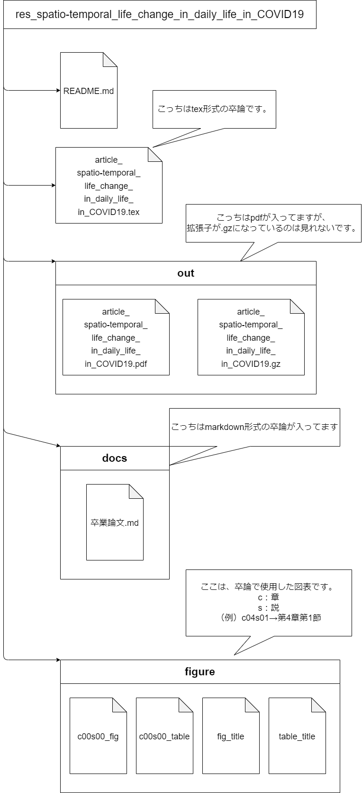

# 新型コロナウイルス感染症における日常生活の時空間変化　-首都圏の三県を事例に-

- [卒業論文（本文）/markdown形式](./Docs/article_新型コロナウイルス感染症における日常生活の時空間変化.md)  
- 卒業論文（本文）/PDF形式→容量が大きいので、後々、公開します。markdown形式で見てもらえるとうれしいです。  
  - [PDFの中身 /tex形式](./Docs/article_spatio-temporal_life_change_in_daily_life_in_COVID19.tex)

※PDF/tex形式の参考文献リストは作成中です、、、

## Directly Structure (このリポジトリのフォルダ構成)

2025/02/02
再設計してます。

